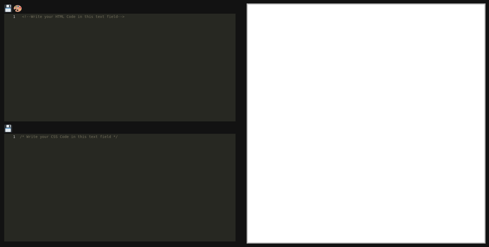

# Frontend

## How to use

Write HTML-Code in the first editor and CSS in the second editor.

## To-Do

<ul>
<li>
Implement the Possibility to switch between HTML and HTML/CSS mode.
Its hardcoded now. You can change the 
viewBoth variable in the init function anc compile again to use another mode.
</li> 
<li> Cleanup Code  </li> 
</ul>

## Try it

<a href ="https://theghostoftomjoad.github.io/"> https://theghostoftomjoad.github.io/ </a>

## Build it

```shell
npm install
elm make src/Main.elm --output main.js --debug
# stack install wai-app-static # To get the warp server
warp # Or serve it in your preferred way
```

Should look like this


## Sources


The code isinspired by this repo:
https://github.com/tommyengstrom/codemirror-elm
